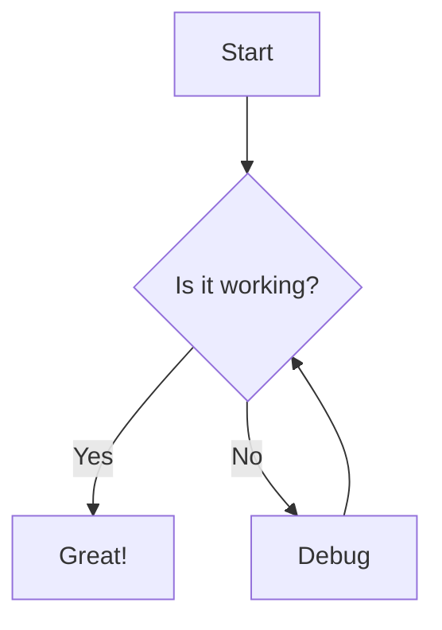
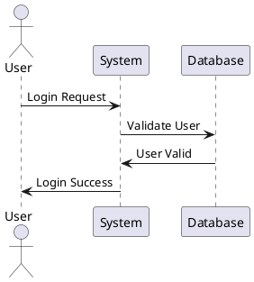
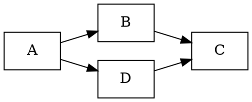

# 🎨 Markdown to OneNote Converter

[](https://allarddewinter.github.io/markdown-to-onenote/)
[](https://opensource.org/licenses/MIT)
[](https://developer.mozilla.org/en-US/docs/Web/JavaScript)
[](https://developer.mozilla.org/en-US/docs/Web/CSS)
[](https://developer.mozilla.org/en-US/docs/Web/HTML)

> ✨ Transform your Markdown content into beautiful OneNote-compatible format with advanced diagram support and modern styling

## 🚀 Live Demo

**[Try it now on GitHub Pages!](https://allarddewinter.github.io/markdown-to-onenote/)**

## 🌟 Features

### 📝 Core Functionality
- **Real-time Markdown Conversion** - See your content transform as you type
- **OneNote Optimization** - Specially formatted for seamless OneNote integration
- **Dual Output Modes** - Choose between OneNote-compatible PNG diagrams or web-friendly SVG
- **File Upload Support** - Load `.md` and `.txt` files directly
- **Export Options** - Copy to clipboard or download as HTML

### 🎨 Diagram Support
- **🧜‍♀️ Mermaid Diagrams** - Flowcharts, sequence diagrams, and more
- **🌿 PlantUML Diagrams** - UML diagrams with full PlantUML syntax support
- **📊 GraphViz Diagrams** - Powerful graph visualization with DOT notation
- **PNG/SVG Export** - Automatic conversion for OneNote compatibility

### 🎨 Modern UI/UX
- **Dark Theme Design** - Easy on the eyes with GitHub-inspired styling
- **Responsive Layout** - Perfect on desktop, tablet, and mobile
- **Glass Morphism Effects** - Modern backdrop blur and transparency
- **Smooth Animations** - Subtle transitions and hover effects
- **Custom Scrollbars** - Styled scrollbars for consistent experience

## 🛠️ Technologies Used

### Frontend Stack
- **Vanilla JavaScript (ES6+)** - Modern JavaScript with async/await
- **CSS3 with Custom Properties** - Advanced styling with CSS variables
- **HTML5** - Semantic markup with accessibility features

### Libraries & Dependencies
- **[Marked.js v5.0.2](https://marked.js.org/)** - Fast Markdown parser
- **[Mermaid.js](https://mermaid-js.github.io/)** - Diagram and flowchart generation
- **[PlantUML Encoder](https://www.npmjs.com/package/plantuml-encoder)** - PlantUML diagram encoding
- **[@hpcc-js/wasm](https://github.com/hpcc-systems/hpcc-js-wasm)** - GraphViz WebAssembly implementation

### Design Features
- **Google Fonts** - Inter & JetBrains Mono for optimal readability
- **CSS Grid & Flexbox** - Modern layout systems
- **CSS Gradients** - Beautiful color transitions
- **CSS Animations** - Smooth micro-interactions
- **Responsive Design** - Mobile-first approach

## 🎯 Use Cases

### 📚 Documentation
- Convert technical documentation to OneNote
- Preserve code syntax highlighting
- Include flowcharts and diagrams

### 📊 Project Planning
- Transform project plans with Gantt charts
- Convert user story mapping to OneNote
- Include architecture diagrams

### 🎓 Education
- Convert course notes with mathematical notation
- Include concept maps and mind maps
- Transform study guides with visual elements

### 💼 Business
- Convert meeting notes with action items
- Include process flow diagrams
- Transform project proposals with charts

## 🚀 Getting Started

### Option 1: Use Online (Recommended)
1. Visit [https://allarddewinter.github.io/markdown-to-onenote/](https://allarddewinter.github.io/markdown-to-onenote/)
2. Paste your Markdown content
3. Select output mode (OneNote or HTML)
4. Copy the result to your clipboard
5. Paste directly into OneNote

### Option 2: Local Development
```bash
# Clone the repository
git clone https://github.com/allarddewinter/markdown-to-onenote.git

# Navigate to the project directory
cd markdown-to-onenote

# Open with a local server (recommended)
# Using Python 3
python -m http.server 8000

# Using Node.js (if you have http-server installed)
npx http-server

# Or simply open index.html in your browser
```

## 📖 Usage Examples

### Basic Markdown
```markdown
# My Project Documentation

## Overview
This is a **sample** project with _italic_ text and `inline code`.

### Features
- Feature 1
- Feature 2
- Feature 3
```

### Mermaid Diagrams
````markdown

````

### PlantUML Diagrams
````markdown

````

### GraphViz Diagrams
````markdown

````

## ⚙️ Configuration

### Output Modes

#### OneNote Mode (Default)
- Converts diagrams to PNG images
- Optimized for OneNote compatibility
- Best for final documentation

#### HTML Mode
- Keeps diagrams as SVG
- Better for web viewing
- Smaller file sizes

### Diagram Rendering

The application automatically detects and renders:
- **Mermaid**: \`\`\`mermaid code blocks
- **PlantUML**: \`\`\`plantuml code blocks  
- **GraphViz**: \`\`\`graphviz or \`\`\`dot code blocks

## 🎨 Styling Features

### CSS Custom Properties
The application uses CSS variables for easy customization:
```css
:root {
    --bg-primary: #0d1117;
    --text-primary: #f0f6fc;
    --border-accent: #58a6ff;
    /* ... and many more */
}
```

### Responsive Breakpoints
- **Desktop**: 1200px and above
- **Tablet**: 768px - 1199px
- **Mobile**: Below 768px

## 🔧 Browser Compatibility

| Browser | Version | Status |
|---------|---------|--------|
| Chrome | 80+ | ✅ Full Support |
| Firefox | 75+ | ✅ Full Support |
| Safari | 13+ | ✅ Full Support |
| Edge | 80+ | ✅ Full Support |

### Required APIs
- **Clipboard API** - For copy functionality
- **Canvas API** - For diagram PNG conversion
- **WebAssembly** - For GraphViz rendering

## 🤝 Contributing

Contributions are welcome! Here's how you can help:

### 🐛 Bug Reports
- Use the [issue tracker](https://github.com/allarddewinter/markdown-to-onenote/issues)
- Include browser version and steps to reproduce
- Provide sample Markdown that causes issues

### 💡 Feature Requests
- Check existing issues first
- Describe the use case and expected behavior
- Consider contributing a pull request

### 🔧 Development
1. Fork the repository
2. Create a feature branch: `git checkout -b feature-name`
3. Make your changes
4. Test thoroughly
5. Submit a pull request

### 📝 Code Style
- Use ES6+ features
- Follow existing naming conventions
- Add comments for complex logic
- Test with multiple browsers

## 📚 API Reference

### MarkdownToOneNoteConverter Class

#### Constructor
```javascript
const converter = new MarkdownToOneNoteConverter();
```

#### Methods
- `convertMarkdown()` - Convert current input to HTML
- `clearContent()` - Clear input and output
- `copyToClipboard()` - Copy result to clipboard
- `downloadHTML()` - Download result as HTML file
- `loadFile(event)` - Load file from input

#### Diagram Processors
- `processMermaidDiagrams(markdown)` - Process Mermaid diagrams
- `processPlantUMLDiagrams(markdown)` - Process PlantUML diagrams
- `processGraphVizDiagrams(markdown)` - Process GraphViz diagrams

## 🎯 Roadmap

### 🔄 Version 2.0 (Planned)
- [ ] **Math Equation Support** - LaTeX/MathJax integration
- [ ] **Custom CSS Themes** - User-defined styling
- [ ] **Batch File Processing** - Multiple file conversion
- [ ] **Advanced Export Options** - PDF, Word, etc.

## 📄 License

This project is licensed under the MIT License - see the LICENSE file for details.

## 🙏 Acknowledgments

- **[Marked.js](https://marked.js.org/)** - For excellent Markdown parsing
- **[Mermaid.js](https://mermaid-js.github.io/)** - For beautiful diagram generation
- **[PlantUML](https://plantuml.com/)** - For comprehensive UML support
- **[GraphViz](https://graphviz.org/)** - For powerful graph visualization
- **[Google Fonts](https://fonts.google.com/)** - For beautiful typography

## 📞 Support

- **GitHub Issues**: [Report bugs or request features](https://github.com/allarddewinter/markdown-to-onenote/issues)
- **Discussions**: [Ask questions or share ideas](https://github.com/allarddewinter/markdown-to-onenote/discussions)
- **Email**: [Contact the maintainer](mailto:your-email@example.com)

---

<div align="center">

**Made with ❤️ by [Allard de Winter](https://github.com/allarddewinter)**

⭐ **Found this helpful? Give it a star!** ⭐

</div>
